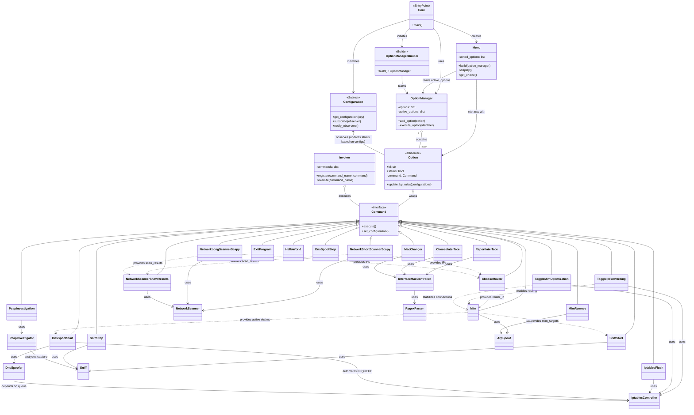

# Cybsec Network Toolkit 🛡️


A comprehensive Python-based cybersecurity network toolkit for educational purposes and controlled environment testing.

> [!IMPORTANT]
> **FOR EDUCATIONAL PURPOSES ONLY.**  
> The use of these tools against network infrastructures without prior permission is illegal. The author is not responsible for any misuse, damage, or legal consequences caused by this software. Use ethically and only in controlled test environments.

---

## 📑 Table of Contents
- [Features & Commands](#-features--commands)
- [Architecture](#-architecture)
- [Technical Details](#-technical-details)
- [Useful Cheatsheet](#-useful-cheatsheet)

---

## 🚀 Features & Commands

The toolkit is built using the Command Pattern and offers a variety of network operations:

### Scanning & Discovery
- **NetworkShortScannerScapy**: Performs a quick ARP network scan.
- **NetworkLongScannerScapy**: Performs a deep scan with OS/Hostname detection.
- **NetworkScannerShowResults**: Displays the latest scan results.
- **ChooseRouter**: Gateway selection for attacks.

### Interface & Identity
- **ReportInterface / ChooseInterface**: Network interface management.
- **MacChanger**: Hardware MAC address modification.

### Traffic Manipulation (Man-In-The-Middle)
- **Mim / MimRemove**: Man-In-The-Middle (ARP Spoofing) attack management.
- **SniffStart / SniffStop**: Traffic capture (HTTP log + Raw PCAP).
- **DnsSpoofStart / DnsSpoofStop**: DNS Spoofing attack (Redirection via NFQUEUE).
- **PcapInvestigation**: Forensic analysis of captured traffic.

### Kernel Network Configuration
- **ToggleIpForwarding**: Manage Linux kernel IP forwarding.
- **ToggleMimOptimization**: Manage TCP MSS Clamping optimization.
- **IptablesFlush**: Full system reset of all network rules.

### System
- **ExitProgram / HelloWorld**: Basic system commands.

---

## 🏗️ Architecture

The application is structured using modular design patterns to ensure scalability and maintainability.



---

## ⚙️ Technical Details

To perform a successful Man-In-The-Middle attack without the victim losing internet access, two Linux kernel configurations are used in the toolkit:

### 1. IP Forwarding (`ToggleIpForwarding`)
*   **What it does:** Allows your Linux kernel to act as a router. It receives packets meant for another device and "forwards" them to the correct destination.
*   **Why it's needed:** During ARP Spoofing, the victim sends packets to **you** thinking you are the router. If Forwarding is `OFF`, your computer drops those packets and the victim loses internet. With it `ON`, you pass the packets to the real router.
*   **Command Behind the Scenes:** `echo 1 > /proc/sys/net/ipv4/ip_forward`

### 2. TCP MSS Clamping (`ToggleMimOptimization`)
*   **What it does:** Modifies the Maximum Segment Size (MSS) in TCP handshake packets.
*   **Why it's needed:** When acting as a middleman, some packets from heavy sites (like GitHub or Google) might be too large for your network interface or for the "extra hop" created by the attack. If the packet is too big and has the "Don't Fragment" flag, it gets dropped.
*   **The solution:** This command uses `iptables` to tell the victim: *"Hey, send me smaller packets (segments)"*. This ensures the traffic flows smoothly without being dropped by MTU (Maximum Transmission Unit) limits.

---

## 📝 Useful Cheatsheet

### Windows Networking
Retrieve saved Wi-Fi passwords:
```cmd
netsh wlan show profile
netsh wlan show profile <Network_Name> key=clear
```

### Kali Linux VM Setup
Configure VMware shared folder and mount it:
```bash
# In VMware configurations, connect the shared folder first
cd /mnt/hgfs
sudo vim /etc/fstab
# Add: vmhgfs-fuse /mnt/hgfs fuse defaults,allow_other,nofail 0 0
sudo reboot now
ls /mnt/hgfs
```

Update Docker:
```bash
sudo apt update
sudo apt upgrade docker.io
```

### Networking & Anonymity (Linux)
Change MAC Address (Anonymity):
```bash
ifconfig wlan0 down
ifconfig wlan0 hw ether 00:11:22:33:44:55
ifconfig wlan0 up
```

Network Discovery Tools:
```bash
sudo netdiscover -r 192.168.1.1/24
sudo nmap --osscan-guess "192.168.1.1/24"
```

Manual ARP Spoofing:
```bash
arpspoof -i wlan0 -t 192.168.1.226 192.168.1.1
arpspoof -i wlan0 -t 192.168.1.1 192.168.1.226
```

### ARP Fundamentals
- **ARP REQUEST**: Broadcast `MaxAddress` (Who has MAC Address X?)
- **ARP RECEIVE**: My MAC Address is X.
- **See ARP TABLE**: `arp -a`
