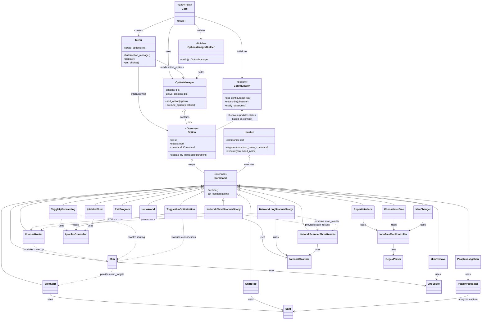

# TODO: Format Readme
# WINDOWS
wifi passwords saved 
netsh wlan show profile
netsh wlan show profile Nome_da_rede key=clear

# KALI LINUX DEBIAN VM
## shared folder with Main Machine
Configure in VMWARE the share folder and inside vm run commands:
connect share folder in configurations
cd /mnt/hgfs
sudo vim /etc/fstab
vmhgfs-fuse /mnt/hgfs fuse defaults,allow_other,nofail 0 0
sudo reboot now
ls /mnt/hgfs

# Docker in Kali Linux
sudo apt update
sudo apt upgrade docker.io

# ip configuration
ifconfig

#connect adaptor 
first disconect nat and then connect adapter wifi

# Anonymity
ifconfig wlan0 down
ifconfig wlan0 hw ether 00:11:22:33:44:55
ifconfig wlan0 up
ifconfig

# network discover
## netdiscover
sudo netdiscover -r 192.168.1.1/24
## nmap
sudo nmap --osscan-guess "192.168.1.1/24" 

# ARP SPOOF
## arpsoof
arpspoof -i wlan0 -t 192.168.1.226 192.168.1.1
arpspoof -i wlan0 -t 192.168.1.1 192.168.1.226

# IP Forwarding

The command `echo 1 > /proc/sys/net/ipv4/ip_forward` is used in Linux to enable IP forwarding. Here's a breakdown of what each part of the command does:

- `echo 1`: This outputs the number `1`.
- `>`: This is a redirection operator that takes the output from the command on its left and writes it to the file on its right.
- `/proc/sys/net/ipv4/ip_forward`: This is a special file in the Linux filesystem that controls the IP forwarding feature.

When you write `1` to this file, you enable IP forwarding, which allows the system to forward packets from one network interface to another. This is essential for setting up a Linux machine as a router or gateway.

Here's a more detailed explanation of each component:

- `echo`: A command that prints its arguments to the standard output.
- `1`: The value to be written, where `1` enables IP forwarding.
- `>`: Redirection operator to direct the output to a file.
- `/proc/sys/net/ipv4/ip_forward`: A pseudo-file that controls IP forwarding settings. Writing `1` to this file turns on IP forwarding, while writing `0` turns it off.

By enabling IP forwarding, your Linux system can route traffic between different network interfaces, which is a key feature for network gateways, routers, or when setting up network address translation (NAT).

# ARP
## ARP REQUEST
Broadcast MaxAddress 
Who are mac Address x
## ARP RECEIVE
My Mac Address is x
## see MY ARP TABLE
arp -a 
## ARP RESPONSE

## Class Diagram

## Available Commands (Command Pattern)

The following classes inherit from the base `Command` interface:

- **NetworkShortScannerScapy**: Performs a quick ARP network scan.
- **NetworkLongScannerScapy**: Performs a deep scan with OS/Hostname detection.
- **NetworkScannerShowResults**: Displays the latest scan results.
- **ReportInterface / ChooseInterface**: Interface management.
- **MacChanger**: HW address modification.
- **ExitProgram / HelloWorld**: Basic system commands.
- **ChooseRouter**: Gateway selection for attacks.
- **Mim / MimRemove**: Man-In-The-Middle (ARP Spoofing) attack management.
- **SniffStart / SniffStop**: Traffic capture (HTTP log + Raw PCAP).
- **PcapInvestigation**: Forensic analysis of captured traffic.
- **ToggleIpForwarding**: Manage Linux kernel IP forwarding (Now in `iptables_manager`).
- **ToggleMimOptimization**: Manage TCP MSS Clamping optimization (Now in `iptables_manager`).
- **IptablesFlush**: [NEW] Full system reset of all network rules to default state.

## 📝 IP and Connectivity Commands Detail

To perform a successful Man-In-The-Middle attack without the victim losing internet access, two Linux kernel configurations are used:

### 1. IP Forwarding (`ToggleIpForwarding`)
*   **What it does:** Allows your Linux kernel to act as a router. It receives packets meant for another device and "forwards" them to the correct destination.
*   **Why it's needed:** During ARP Spoofing, the victim sends packets to **you** thinking you are the router. If Forwarding is `OFF`, your computer drops those packets and the victim loses internet. With it `ON`, you pass the packets to the real router.

### 2. TCP MSS Clamping (`ToggleMimOptimization`)
*   **What it does:** Modifies the Maximum Segment Size (MSS) in TCP handshake packets.
*   **Why it's needed:** When acting as a middleman, some packets from heavy sites (like GitHub or Google) might be too large for your network interface or for the "extra hop" created by the attack. If the packet is too big and has the "Don't Fragment" flag, it gets dropped.
*   **The solution:** This command tells the victim: *"Hey, send me smaller packets (segments)"*. This ensures the traffic flows smoothly without being dropped by MTU (Maximum Transmission Unit) limits.
